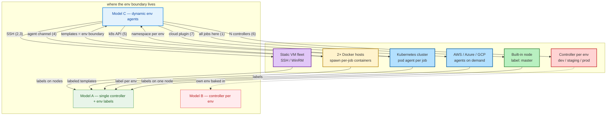

# All Ways to Model Jenkins Workers + Multi-Env

This is the full menu of how to provision Jenkins **workers/agents** and how to
model the **multi-environment** part. Every method below has a diagram. The
baseline chosen for this project is **Method 4 (Docker ephemeral agents)** with
**Env model A (single controller, env-labeled agents)** — see
`architecture.md`.

Quick reference:

| # | Method | Worker model | Env isolation | Complexity |
|---|---|---|---|---|
| 1 | Controller built-in node | none (all on controller) | labels on one node | very low |
| 2 | Static SSH agents (Linux VMs) | fixed VMs over SSH | label per VM/env | low |
| 3 | Static agents, mixed OS (+Windows) | fixed VMs, some Windows | label per VM/env | low–med |
| 4 | Docker ephemeral agents | containers on Docker hosts | label per env template | med |
| 5 | Kubernetes pod agents | pods per job | namespace/label per env | high |
| 6 | Controller per environment | each env has its own fleet | hard (separate controllers) | high |
| 7 | Serverless / cloud-native agents | spawned by cloud (AWS/Azure/GCP) | label per env | med–high |

## Full overview (colored)

One picture of every worker model feeding the same multi-env idea. Green boxes
run on the controller, purple boxes are self-hosted worker fleets, blue boxes
are on-demand/cloud-provisioned, and the bottom row shows the three possible
places the env boundary can live.



Legend: 1=controller node, 2=static SSH Linux, 3=static mixed OS,
4=Docker ephemeral (baseline), 5=Kubernetes, 6=controller per env,
7=cloud/serverless.

---

## Method 1 — Controller built-in node (single machine)

Run everything on the controller's built-in node. No separate workers.

```
        ┌──────────────────────────────────────────┐
        │   Jenkins Controller (single host)       │
        │                                          │
        │   ┌──────────────────────────────────┐   │
        │   │  built-in node (label: "master") │   │
        │   │  runs ALL jobs (dev/stage/prod)  │   │
        │   └──────────────────────────────────┘   │
        │                                          │
        │   every pipeline: agent { label 'master' }│
        └──────────────────────────────────────────┘
                 envs = just different jobs
```

- **Pros:** zero extra infra; simplest possible.
- **Cons:** no isolation, no scaling, heavy builds and CI/UI compete for one
  machine; Jenkins recommends against running real workloads on the controller.
- **Use when:** tiny demo (<5 jobs), one machine, purely exploratory.

---

## Method 2 — Static SSH agents (Linux VMs)

Controller keeps a fixed list of worker VMs and connects over SSH.

```
   ┌──────────────────────┐          ┌──────────────────────────────┐
   │  Jenkins Controller  │          │        WORKERS (VMs)         │
   │       ("master")     │          │                              │
   │  UI 8080 / 50000     │          │  ┌────────────────────────┐  │
   │                      │  SSH     │  │  worker-dev            │  │
   │  Node list:          │◄────────►│  │  labels: linux dev     │  │
   │   worker-dev         │          │  └────────────────────────┘  │
   │   worker-staging     │  SSH     │  ┌────────────────────────┐  │
   │   worker-prod        │◄────────►│  │  worker-staging         │  │
   └──────────────────────┘          │  │  labels: linux staging │  │
                                     │  └────────────────────────┘  │
                                     │  ┌────────────────────────┐  │
                                     │  │  worker-prod            │  │
                                     │  │  labels: linux prod     │  │
                                     │  └────────────────────────┘  │
                                     └──────────────────────────────┘
      pipeline: agent { label 'linux prod' }  -> runs on worker-prod
```

- **Pros:** simple and predictable; fixed capacity; full control of the worker
  OS; good for heavy native/stateful builds; worker = env gives clean mental
  model and credential segregation.
- **Cons:** capacity is fixed (manual scale-out); you patch/provision each VM;
  leftover state between builds must be cleaned manually.
- **Use when:** you actually mean "1 master + 2–3 fixed machines" and you want
  each worker to physically represent an environment.

---

## Method 3 — Static agents, mixed OS (Linux + Windows)

Same as Method 2 but the fleet includes a Windows machine (registered as a
Windows service or via SSH/agent), for cross-platform builds.

```
   ┌──────────────────────┐          ┌──────────────────────────────┐
   │  Jenkins Controller  │          │         WORKER FLEET         │
   │                      │          │                              │
   │  Node list:          │  SSH     │  ┌────────────────────────┐  │
   │   worker-linux       │◄────────►│  │ worker-linux (VM)      │  │
   │   worker-windows     │          │  │ labels: linux build dev│  │
   └──────────────────────┘          │  └────────────────────────┘  │
                                     │                              │
                                     │  WinRM/           ┌──────────▼───────┐
                                     │  service  ┌──────►│ worker-windows   │
                                     │          │       │ labels: windows   │
                                     │          │       └───────────────────┘
                                     └──────────┘   e.g. MSVC / .NET only
```

- **Pros:** cross-platform compile/test on the same controller; matches a
  Windows dev machine building Linux targets.
- **Cons:** Windows agent upkeep (service, updates, licensing); extra moving
  part vs a pure-Linux Docker fleet.
- **Use when:** the product must build or run on Windows, or you compile
  native code needing MSVC.

---

## Method 4 — Docker ephemeral agents (BASELINE for this project)

Workers are two (or more) always-on **Docker hosts**. Each job requests a
label; Docker spins up a clean, ephemeral agent container on a host, runs the
job, then destroys it. Environments are modeled as **labeled agent templates**.

```
   ┌─────────────────────────────┐
   │  Jenkins Controller         │
   │  (JCasC, "master")          │
   └─────────────┬───────────────┘
                 │ inbound agent connection
   ┌─────────────▼───────────────────────────────────┐
   │           WORKER NODES = Docker hosts           │
   │  ┌──────────────────────┐  ┌──────────────────┐ │
   │  │  Docker Host A       │  │  Docker Host B   │ │
   │  └──────────┬───────────┘  └────────┬─────────┘ │
   └─────────────┼───────────────────────┼───────────┘
                 │ spawn per-label ephemeral containers
        ┌────────▼──────┬─────────┬─────────┬─────────────┐
        │               │         │         │             │
   ┌────▼────┐    ┌─────▼────┐ ┌──▼────┐ ┌──▼────┐  ┌─────▼─────┐
   │ build   │    │ dev agent│ │ staging│ │ prod  │  │ tool/test │
   │ label:  │    │ label:   │ │ label: │ │ label:│  │ label:    │
   │ docker- │    │ docker-  │ │ docker-│ │ docker│  │ docker-   │
   │ build   │    │ dev      │ │ staging│ │ -prod │  │ build     │
   └─────────┘    └──────────┘ └────────┘ └───────┘  └───────────┘
      ephemeral containers, clean per run (dev / staging / prod)
```

- **Pros:** clean reproducible env every run; cheap parallelism; no leftover
  state; fleet = the two hosts, templates = the env boundary.
- **Cons:** container overhead; image upkeep; Docker-in-Docker pain; stateless
  by default (need volumes/registry for persistence).
- **Use when:** commodity Linux builds and you want cleanliness + elasticity
  without managing a K8s cluster. This is the chosen baseline.

---

## Method 5 — Kubernetes pod agents

Agents are **pods** launched by the Kubernetes plugin from pod templates,
usually one pod per environment namespace.

```
   ┌────────────────────┐
   │ Jenkins Controller │
   └─────────┬──────────┘
             │ k8s API (agent pod per job)
   ┌─────────▼──────────────────────────────────────────────┐
   │                  Kubernetes cluster                    │
   │  ┌────────────────┐  ┌────────────────┐  ┌───────────┐ │
   │  │ ns: ci         │  │ ns: staging    │  │ ns: prod  │ │
   │  │ pod (build)    │  │ pod            │  │ pod       │ │
   │  │ pod (dev deploy│  │ (deploy stage) │  │ (deploy)  │ │
   │  └────────────────┘  └────────────────┘  └───────────┘ │
   └────────────────────────────────────────────────────────┘
   pipeline: agent { kubernetes { label 'ci-build' } }
```

- **Pros:** elastic scale-to-zero; per-env namespaces give strong isolation;
  cloud-native, no VM fleet to run.
- **Cons:** real infra complexity — you must already run (and operate) a
  cluster; pod-template curation and in-cluster DNS/imagePull secrets.
- **Use when:** you run Kubernetes anyway and want per-run elasticity at scale.

---

## Method 6 — Controller per environment (hard isolation)

Each environment gets its own full Jenkins controller and its own workers —
no sharing of state or credentials at all.

```
   ┌──────────────┐   ┌──────────────┐   ┌──────────────┐
   │ Jenkins dev  │   │Jenkins staging│  │Jenkins prod  │
   └──────┬───────┘   └──────┬───────┘   └──────┬───────┘
          │                  │                  │
   ┌──────▼──────┐   ┌──────▼───────┐  ┌───────▼──────┐
   │  dev workers│   │stage workers │  │ prod workers │
   │ (static or  │   │              │  │              │
   │  docker)    │   │              │  │              │
   └─────────────┘   └──────────────┘  └──────────────┘
   app promoted: build image once -> push to registry -> each controller
   deploys the same digest into its own environment
```

- **Pros:** strongest isolation (blast radius, credentials, config); good for
  regulated environments / prod segregation.
- **Cons:** N controllers to run, back up, upgrade, secure; drift between
  controllers; more cost and ops.
- **Use when:** legal/regulatory separation is mandatory, or prod must never
  share anything with dev.

---

## Method 7 — Cloud/serverless-native agents (AWS/Azure/GCP)

Workers are provisioned on demand by a cloud provider (e.g. EC2 Fleet, Azure
VM agents, AWS ECS/GKE tasks) instead of self-managed hosts.

```
   ┌─────────────────────┐
   │ Jenkins Controller  │
   └─────────┬───────────┘
             │ cloud plugin / webhook (scale up per label)
   ┌─────────▼────────────────────────────────┐
   │        Cloud provider (EC2/VM/ECS)       │
   │   ┌──────────┐   ┌──────────┐   ┌──────┐ │
   │   │ agent A  │   │ agent B  │   │  C   │ │  <- spun up on demand
   │   │ dev/stage│   │ staging  │   │ prod │ │     for jobs, torn down
   │   └──────────┘   └──────────┘   └──────┘ │     when idle
   └──────────────────────────────────────────┘
```

- **Pros:** pay only for what you use; elastic scale with zero idle fleet;
  provider-managed OS/images.
- **Cons:** network/security setup for the controller->agent channel; latency
  to boot an agent; vendor lock-in; costs can surprise on heavy fleets.
- **Use when:** bursty CI loads and you already live in one cloud.

---

## Environment architecture dimension (independent of worker model)

The worker methods above say *how* an agent runs. Separately, you choose *where
the env boundary lives*:

- **Model A — Single controller + env labels (chosen):** one controller, agents
  or templates labeled `dev`/`staging`/`prod`; jobs target a label; promotion
  gates move artifacts between envs. Central and simple (Methods 1–5, 7).
- **Model B — Controller per env:** hard isolation, N controllers (Method 6).
- **Model C — Dynamic env agents:** ephemeral agents *are* the env boundary
  (Docker templates per env / K8s namespaces), strongest per-run isolation,
  most moving parts (Methods 4–5).

Whatever worker method you pick, keep the promotion rule identical: **build
once, promote immutable digests/artifacts, gate prod with an approval.**
